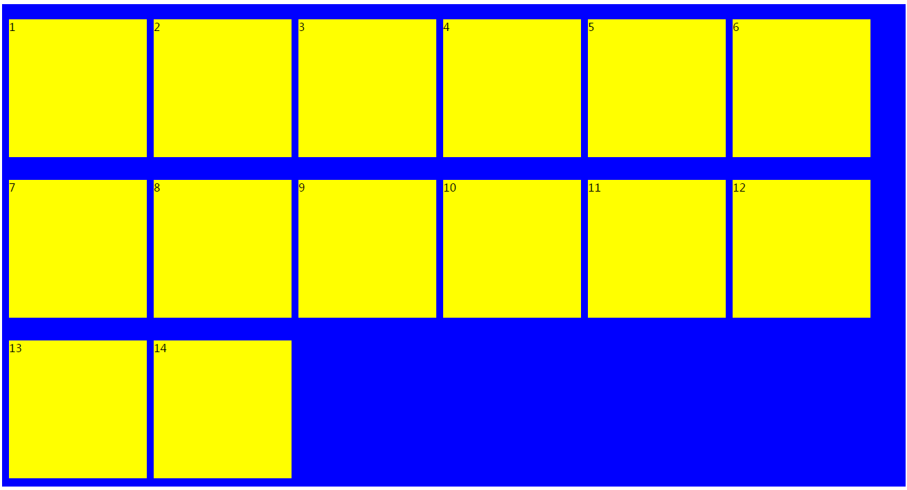

flex布局demo
# 一、Flex 布局是什么？fdfdsfffffffffffffffffffffffffffffffffffffffffffffffffffffffffffffffffffff
Flex 是 Flexible Box 的缩写，意为"弹性布局"，用来为盒状模型提供最大的灵活性。
任何一个容器都可以指定为 Flex 布局。
采用 Flex 布局的元素，称为 Flex 容器（flex container），
简称"容器"。它的所有子元素自动成为容器成员，
称为 Flex 项目（flex item），简称"项目"。
## 容器拥有六个属性
* flex-direction属性决定主轴的方向（即项目的排列方向）
* flex-wrap属性定义，如果一条轴线排不下，如何换行。
* flex-flow属性是flex-direction属性和flex-wrap属性的简写形式，默认值为row nowrap
* justify-content属性定义了项目在主轴上的对齐方式。
* align-items属性定义项目在交叉轴上如何对齐。
* align-content属性定义了多根轴线的对齐方式。如果项目只有一根轴线，该属性不起作用。
### flex-direction 有4个值
* row（默认值）：主轴为水平方向，起点在左端。
* row-reverse：主轴为水平方向，起点在右端。
* column：主轴为垂直方向，起点在上沿。
* column-reverse：主轴为垂直方向，起点在下沿
```
<!DOCTYPE html>
<html>
<head lang="en">
    <meta charset="UTF-8">
    <title></title>
    <style>
        .box{
            display: flex;
            flex-direction:row;
        }
        .box-child{
            width:100px;
            height:100px;
            margin-left:10px;
            margin-top:10px;
            background:yellow;
        }
        .box-rs{
            display:flex;
            flex-direction:row-reverse;
        }
        .box-column{
            display:flex;
            flex-direction:column;
        }
        .box-column-reverse{
            display:flex;
            flex-direction:column-reverse;
            background:green;
        }
    </style>
</head>
<body>
<div class="box">
    <div class="box-child">1</div>
    <div class="box-child">2</div>
    <div class="box-child">3</div>
    <div class="box-child">4</div>
    <div class="box-child">5</div>
</div>
<div class="box-rs">
    <div class="box-child">1</div>
    <div class="box-child">2</div>
    <div class="box-child">3</div>
    <div class="box-child">4</div>
    <div class="box-child">5</div>
</div>
<div class="box-column">
    <div class="box-child">1</div>
    <div class="box-child">2</div>
    <div class="box-child">3</div>
    <div class="box-child">4</div>
    <div class="box-child">5</div>
</div>
<div class="box-column-reverse">
    <div class="box-child">1</div>
    <div class="box-child">2</div>
    <div class="box-child">3</div>
    <div class="box-child">4</div>
    <div class="box-child">5</div>
</div>
</body>
</html>
```
得到结果如下


默认情况下，项目都排在一条线（又称"轴线"）上。 flex-wrap属性定义， 如果一条轴线排不下， 如何换行。
### flex-wrap可取三个值。
* nowrap（默认）：不换行。
* wrap：换行，第一行在上方。
* wrap-reverse：换行，第一行在下方
```
<!DOCTYPE html>
<html>
<head lang="en">
    <meta charset="UTF-8">
    <title></title>
    <style>
        ul,li{
            margin:0;
            padding:0;
            list-style:none;
        }
        .box{
            display:flex;
            width:500px;
            border:1px solid #000;
            flex-direction:row;/*默认 横向排列 可不写*/
            flex-wrap:nowrap;
        }
        .box-child{
            width:101px;
            height:100px;
            margin-left:10px;
            margin-top:10px;
            background:yellow;
        }
        /*经试验此时box-child自动变成90*/
        .box-wrap{
            display:flex;
            width:500px;
            margin-top:10px;
            border:1px solid blue;
            flex-direction: row;/*默认 横向排列 可不写*/
            flex-wrap:wrap;
        }
        .box-wrap-reverse{
            display: flex;
            width:500px;
            margin-top:10px;
            border:1px solid green;
            flex-direction:row;/*默认 横向排列 可不写*/
            flex-wrap:wrap-reverse;
        }
    </style>
</head>
<body>
<ul class="box">
    <li class="box-child">1</li>
    <li class="box-child">2</li>
    <li class="box-child">3</li>
    <li class="box-child">4</li>
    <li class="box-child">5</li>
</ul>
<ul class="box-wrap">
    <li class="box-child">1</li>
    <li class="box-child">2</li>
    <li class="box-child">3</li>
    <li class="box-child">4</li>
    <li class="box-child">5</li>
</ul>
<ul class="box-wrap-reverse">
    <li class="box-child">1</li>
    <li class="box-child">2</li>
    <li class="box-child">3</li>
    <li class="box-child">4</li>
    <li class="box-child">5</li>
</ul>
</body>
</html>
```
得到结果如下 分别对应 box box-wrap box-wrap-reverse

### flex-flow
lex-flow属性是flex-direction属性和flex-wrap属性的简写形式，默认值为row nowrap。
```
语法.box {
            flex-flow: <flex-direction> 11 <flex-wrap>;
        }
```
```
<!DOCTYPE html>
<html>
<head lang="en">
    <meta charset="UTF-8">
    <title></title>
    <style>
        ul,li{
            margin:0;
            padding:0;
            list-style:none;
        }
        .box{
            display:flex;
            width:500px;
            height:500px;
            border:1px solid #000;
            flex-direction:row;
            flex-wrap: nowrap;
            flex-flow:row-reverse  wrap;
        }
        .box-child{
            width:100px;
            height:100px;
            background:yellow;
            margin-left:10px;
            margin-top:10px;
        }
    </style>
</head>
<body>
<ul class="box">
    <li class="box-child">1</li>
    <li class="box-child">2</li>
    <li class="box-child">3</li>
    <li class="box-child">4</li>
    <li class="box-child">5</li>
</ul>
</body>
</html>
```
得到的结果如下


 经试验flex-flow可设一个值或两个值（若两个值中间用空格隔开）若换行将会把所有的margin-top叠加到最后一个项目的值上面
 
 ### justify-content属性定义了项目在主轴上的对齐方式。
 它可能取5个值，具体对齐方式与轴的方向有关。
* flex-start（默认值）：左对齐
* flex-end：右对齐
* center： 居中
* space-between：两端对齐，项目之间的间隔都相等。
* space-around：每个项目两侧的间隔相等。所以，项目之间的间隔比项目与边框的间隔大一倍。
```
<!DOCTYPE html>
<html>
<head lang="en">
    <meta charset="UTF-8">
    <title></title>
    <style>
        ul,li{
            list-style:none;
            margin:0;
            padding:0;
        }
        .box{
            width:800px;
            height:200px;
            background:blue;
            display:flex;
            flex-direction:row;
            flex-wrap:nowrap;
            flex-flow :row nowrap ;
            justify-content:flex-start;
        }
        .box-child{
            width:100px;
            height:100px;
            background:yellow;
            margin-left:10px;
            margin-top:10px;
        }
        .box-flex-end{
            margin-top:20px;
            width:800px;
            height:200px;
            background:blue;
            display:flex;
            flex-direction: row;
            flex-wrap:nowrap;
            flex-flow:row nowrap;
            justify-content:flex-end;
        }
        .box-flex-center{
            margin-top:20px;
            width:800px;
            height:200px;
            background:blue;
            display:flex;
            flex-direction:row;
            flex-wrap:nowrap;
            flex-flow:row nowrap;
            justify-content:center
        }
        .box-flex-space-between{
            margin-top:20px;
            width:800px;
            height:200px;
            background:blue;
            display:flex;
            flex-direction:row;
            flex-wrap:nowrap;
            flex-flow:row nowrap;
            justify-content:space-between;
        }
        .box-flex-space-around{
            margin-top:20px;
            width:800px;
            height:200px;
            background:blue;
            display:flex;
            flex-direction: row;
            flex-wrap:nowrap;
            flex-flow:row nowrap;
            justify-content:space-around;
        }
    </style>
</head>
<body>
<ul class="box">
    <li class="box-child">1</li>
    <li class="box-child">2</li>
    <li class="box-child">3</li>
    <li class="box-child">4</li>
    <li class="box-child">5</li>
</ul>
<ul class="box-flex-end">
    <li class="box-child">1</li>
    <li class="box-child">2</li>
    <li class="box-child">3</li>
    <li class="box-child">4</li>
    <li class="box-child">5</li>
</ul>
<ul class="box-flex-center">
    <li class="box-child">1</li>
    <li class="box-child">2</li>
    <li class="box-child">3</li>
    <li class="box-child">4</li>
    <li class="box-child">5</li>
</ul>
<ul class="box-flex-space-between">
    <li class="box-child">1</li>
    <li class="box-child">2</li>
    <li class="box-child">3</li>
    <li class="box-child">4</li>
    <li class="box-child">5</li>
</ul>
<ul class="box-flex-space-around">
    <li class="box-child">1</li>
    <li class="box-child">2</li>
    <li class="box-child">3</li>
    <li class="box-child">4</li>
    <li class="box-child">5</li>
</ul>
</body>
</html>
```
得到的结果如下


### align-items属性定义项目在交叉轴上如何对齐。
它可能取5个值。具体的对齐方式与交叉轴的方向有关，下面假设交叉轴从上到下。
* lex-start：交叉轴的起点对齐。
* flex-end：交叉轴的终点对齐。
* center：交叉轴的中点对齐。
* baseline: 项目的第一行文字的基线对齐。
* stretch（默认值）：如果项目未设置高度或设为auto，将占满整个容器的高度。
```
<!DOCTYPE html>
<html>
<head lang="en">
    <meta charset="UTF-8">
    <title></title>
    <style>
        ul,li{
            list-style:none;
            margin:0;
            padding:0;
        }
        .box{
            width:800px;
            height:200px;
            background:blue;
            display:flex;
            flex-direction:row;
            flex-wrap:nowrap;
            flex-flow:row nowrap;
            justify-content:flex-start;
            align-items:flex-start;
        }
        .box-children{
            width:100px;
            height:100px;
            background:yellow;
            margin-left:10px;
            margin-top:10px;
        }
        .box-align-items-flex-end{
            margin-top:20px;
            width:800px;
            height:200px;
            background:blue;
            display:flex;
            flex-direction:row;
            flex-wrap:nowrap;
            flex-flow: row nowrap;
            justify-content: flex-start;
            align-items:flex-end;
        }
        .box-align-items-flex-center{
            margin-top:20px;
            width:800px;
            height:200px;
            background:blue;
            display:flex;
            flex-direction:row;
            flex-wrap:nowrap;
            flex-flow: row nowrap;
            justify-content: flex-start;
            align-items:center;
        }
        .box-align-items-baseline{
            margin-top:20px;
            width:800px;
            height:200px;
            background:blue;
            display:flex;
            flex-direction:row;
            flex-wrap:nowrap;
            flex-flow: row nowrap;
            justify-content: flex-start;
            align-items:baseline;
        }
        .box-align-items-stretch{
            margin-top:20px;
            width:800px;
            height:200px;
            background:blue;
            display:flex;
            flex-direction:row;
            flex-wrap:nowrap;
            flex-flow: row nowrap;
            justify-content: flex-start;
            align-items:stretch;
        }
        .box-child{
            width:100px;
            /*height:100px;*/
            background:yellow;
            margin-left:10px;
            margin-top:10px;
        }
    </style>
</head>
<body>
<ul class="box">
    <li class="box-children">1</li>
    <li class="box-children">2</li>
    <li class="box-children">3</li>
    <li class="box-children">4</li>
    <li class="box-children">5</li>
</ul>
<ul class="box-align-items-flex-end">
    <li class="box-children">1</li>
    <li class="box-children">2</li>
    <li class="box-children">3</li>
    <li class="box-children">4</li>
    <li class="box-children">5</li>
</ul>
<ul class="box-align-items-flex-center">
    <li class="box-children">1</li>
    <li class="box-children">2</li>
    <li class="box-children">3</li>
    <li class="box-children">4</li>
    <li class="box-children">5</li>
</ul>
<ul class="box-align-items-baseline">
    <li class="box-children" style="font-size: 18px">
        1
    </li>
    <li class="box-children" style="font-size: 22px">
        2
    </li>
    <li class="box-children" style="font-size: 30px">
        3
    </li>
    <li class="box-children" style="font-size: 36px">
        4
    </li>
    <li class="box-children" style="font-size: 15px">
        5
    </li>
</ul>
<ul class="box-align-items-stretch">
    <li class="box-child">1</li>
    <li class="box-child">2</li>
    <li class="box-child">3</li>
    <li class="box-child">4</li>
    <li class="box-child">5</li>
</ul>
</body>
</html>
```
得到结果如下


经测试未设置高度则占满整个容器的高度 设置咯高度则为自己的高度值
### align-content属性定义了多根轴线的对齐方式。如果项目只有一根轴线，该属性不起作用。
该属性可能取6个值。
* flex-start：与交叉轴的起点对齐。
* flex-end：与交叉轴的终点对齐。
* center：与交叉轴的中点对齐。
* space-between：与交叉轴两端对齐，轴线之间的间隔平均分布。
* space-around：每根轴线两侧的间隔都相等。所以，轴线之间的间隔比轴线与边框的间隔大一倍。
* stretch（默认值）：轴线占满整个交叉轴。
```
<!DOCTYPE html>
<html>
<head lang="en">
    <meta charset="UTF-8">
    <title></title>
    <style>
        ul,li{
            margin:0;
            padding:0;
        }
        ul,li{list-style:none;}
        .box{
            display:flex;
            flex-direction: row;
            flex-wrap: wrap;
            flex-flow: row wrap;
            justify-content: flex-start;
            align-items:stretch ;
            align-content: flex-start;
            wdith:800px;
            height:700px;
            background:#0000ff;
        }
        .box-child{
            width:200px;
            height:200px;
            background:yellow;
            margin-left:10px;
            margin-top:10px;
        }
        .box-alignContent-flexEnd{
            margin-top:10px;
            display:flex;
            flex-direction: row;
            flex-wrap: wrap;
            flex-flow: row wrap;
            justify-content: flex-start;
            align-items:stretch ;
            align-content: flex-end;
            wdith:800px;
            height:700px;
            background:#0000ff;
        }
        .box-alignContent-center{
            margin-top:10px;
            display:flex;
            flex-direction: row;
            flex-wrap: wrap;
            flex-flow: row wrap;
            justify-content: flex-start;
            align-items:stretch ;
            align-content: center;
            wdith:800px;
            height:700px;
            background:#0000ff;
        }
        .box-alignContent-spaceBetween{
            margin-top:10px;
            display: flex;
            flex-direction: row;
            flex-wrap: wrap;
            flex-flow: row wrap;
            justify-content: flex-start;
            align-items: stretch;
            align-content:space-between;
            wdith:800px;
            height:700px;
            background:#0000ff;
        }
        .box-alignContent-spaceAround{
            margin-top:10px;
            display: flex;
            flex-direction: row;
            flex-wrap: wrap;
            flex-flow: row wrap;
            justify-content: flex-start;
            align-items: stretch;
            align-content:space-around;
            wdith:800px;
            height:700px;
            background:#0000ff;
        }
        .box-alignContent-stretch{
            margin-top:10px;
            display: flex;
            flex-direction: row;
            flex-wrap: wrap;
            flex-flow: row wrap;
            justify-content: flex-start;
            align-items: stretch;
            align-content:stretch;
            wdith:800px;
            height:700px;
            background:#0000ff;
        }
        .box-text{
            margin-top:10px;
            display: flex;
            flex-direction: row;
            flex-wrap: wrap;
            flex-flow: row wrap;
            justify-content: flex-start;
            align-items: stretch;
            align-content:flex-end;
            wdith:800px;
            height:700px;
            background:#0000ff;
        }
    </style>
</head>
<body>
<ul class="box">
    <li class="box-child">1</li>
    <li class="box-child">2</li>
    <li class="box-child">3</li>
    <li class="box-child">4</li>
    <li class="box-child">5</li>
    <li class="box-child">6</li>
    <li class="box-child">7</li>
    <li class="box-child">8</li>
    <li class="box-child">9</li>
    <li class="box-child">10</li>
    <li class="box-child">11</li>
    <li class="box-child">12</li>
    <li class="box-child">13</li>
    <li class="box-child">14</li>
</ul>
<ul class="box-alignContent-flexEnd">
    <li class="box-child">1</li>
    <li class="box-child">2</li>
    <li class="box-child">3</li>
    <li class="box-child">4</li>
    <li class="box-child">5</li>
    <li class="box-child">6</li>
    <li class="box-child">7</li>
    <li class="box-child">8</li>
    <li class="box-child">9</li>
    <li class="box-child">10</li>
    <li class="box-child">11</li>
    <li class="box-child">12</li>
    <li class="box-child">13</li>
    <li class="box-child">14</li>
</ul>
<ul class="box-alignContent-center">
    <li class="box-child">1</li>
    <li class="box-child">2</li>
    <li class="box-child">3</li>
    <li class="box-child">4</li>
    <li class="box-child">5</li>
    <li class="box-child">6</li>
    <li class="box-child">7</li>
    <li class="box-child">8</li>
    <li class="box-child">9</li>
    <li class="box-child">10</li>
    <li class="box-child">11</li>
    <li class="box-child">12</li>
    <li class="box-child">13</li>
    <li class="box-child">14</li>
</ul>
<ul class="box-alignContent-spaceBetween">
    <li class="box-child">1</li>
    <li class="box-child">2</li>
    <li class="box-child">3</li>
    <li class="box-child">4</li>
    <li class="box-child">5</li>
    <li class="box-child">6</li>
    <li class="box-child">7</li>
    <li class="box-child">8</li>
    <li class="box-child">9</li>
    <li class="box-child">10</li>
    <li class="box-child">11</li>
    <li class="box-child">12</li>
    <li class="box-child">13</li>
    <li class="box-child">14</li>
</ul>
<ul class="box-alignContent-spaceAround">
    <li class="box-child">1</li>
    <li class="box-child">2</li>
    <li class="box-child">3</li>
    <li class="box-child">4</li>
    <li class="box-child">5</li>
    <li class="box-child">6</li>
    <li class="box-child">7</li>
    <li class="box-child">8</li>
    <li class="box-child">9</li>
    <li class="box-child">10</li>
    <li class="box-child">11</li>
    <li class="box-child">12</li>
    <li class="box-child">13</li>
    <li class="box-child">14</li>
</ul>
<ul class="box-alignContent-stretch">
    <li class="box-child">1</li>
    <li class="box-child">2</li>
    <li class="box-child">3</li>
    <li class="box-child">4</li>
    <li class="box-child">5</li>
    <li class="box-child">6</li>
    <li class="box-child">7</li>
    <li class="box-child">8</li>
    <li class="box-child">9</li>
    <li class="box-child">10</li>
    <li class="box-child">11</li>
    <li class="box-child">12</li>
    <li class="box-child">13</li>
    <li class="box-child">14</li>
</ul>
<ul class="box-test">
    <li class="box-child">1</li>
    <li class="box-child">2</li>
    <li class="box-child">3</li>
   <!-- <li class="box-child">4</li>
    <li class="box-child">5</li>
    <li class="box-child">6</li>
    <li class="box-child">7</li>
    <li class="box-child">8</li>
    <li class="box-child">9</li>
    <li class="box-child">10</li>
    <li class="box-child">11</li>
    <li class="box-child">12</li>
    <li class="box-child">13</li>
    <li class="box-child">14</li>-->
</ul>
</body>
</html>
```
得到的结果如下





经测试如果项目只有一根轴线，该属性无论设置成任何值均不起作用参照.box-test

### 项目拥有6个属性
分别为
* order属性定义项目的排列顺序。数值越小，排列越靠前，默认为0。
* flex-grow属性定义项目的放大比例，默认为0，即如果存在剩余空间，也不放大。
* flex-shrink属性定义了项目的缩小比例，默认为1，即如果空间不足，该项目将缩小。
* flex-basis属性定义了在分配多余空间之前，项目占据的主轴空间（main size）。浏览器根据这个属性，计算主轴是否有多余空间。它的默认值为auto，即项目的本来大小。
* flex属性是flex-grow, flex-shrink 和 flex-basis的简写，默认值为0 1 auto。后两个属性可选。
* align-self属性允许单个项目有与其他项目不一样的对齐方式，可覆盖align-items属性。默认值为auto，表示继承父元素的align-items属性，如果没有父元素，则等同于stretch。
```
<!DOCTYPE html>
<html>
<head lang="en">
    <meta charset="UTF-8">
    <title></title>
    <style>
        ul,li{
            list-style: none;
            margin:0;
            padding:0;
        }
        .box{
            display:flex;
            width:800px;
            height:200px;
            background:#0000ff;
        }
        .box-child{
            width:200px;
            height:100px;
            margin-left:10px;
            background:#ffff00;
        }
        .box-flexGrow{
            width:100px;
            height:100px;
            margin-left:10px;
            background:#ffff00;
            flex-grow: 0;
        }
        .box-flexShrink{
            width:200px;
            height:100px;
            margin-left:10px;
            background:#ffff00;
            flex-shrink:1;
        }
        .box-flexBasis{
            width:100px;
            height:100px;
            margin-left:10px;
            background:#ffff00;
            flex-basis: auto;
        }
    </style>
</head>
<body>
<ul class="box">
    <li class="box-child" style="order:5;">1</li>
    <li class="box-child">2</li>
    <li class="box-child">3</li>
    <li class="box-child" style="order: -2;">4</li>
    <li class="box-child">5</li>
</ul>
<ul class="box" style="margin-top:10px;">
    <li class="box-flexGrow">1</li>
    <li class="box-flexGrow">2</li>
    <li class="box-flexGrow" style="flex-grow: 2">3</li>
    <li class="box-flexGrow">4</li>
    <li class="box-flexGrow">5</li>
</ul>
<ul class="box" style="margin-top:10px;">
    <li class="box-flexShrink">1</li>
    <li class="box-flexShrink">2</li>
    <li class="box-flexShrink" style="flex-shrink: 2;">3</li>
    <li class="box-flexShrink">4</li>
    <li class="box-flexShrink">5</li>
</ul>
<ul class="box" style="margin-top:10px;">
    <li class="box-flexBasis">1</li>
    <li class="box-flexBasis">2</li>
    <li class="box-flexBasis" style="flex-basis:200px;">3</li>
    <li class="box-flexBasis">4</li>
    <li class="box-flexBasis">5</li>
</ul>
</body>
</html>
```
得到的结果分别为


定义项目的排列顺序。数值越小，排列越靠前，默认为0。可为负.


如果所有项目的flex-grow属性都为1，则它们将等分剩余空间（如果有的话）。如果一个项目的flex-grow属性为2，其他项目都为1，则前者占据的剩余空间将比其他项多一倍。负值对其有效


如果所有项目的flex-shrink属性都为1，当空间不足时，都将等比例缩小。如果一个项目的flex-shrink属性为0，其他项目都为1，则空间不足时，前者不缩小。
负值对该属性无效。

item3 flex-basis值为200px其它item值为augo

flex属性是flex-grow, flex-shrink 和 flex-basis的简写，默认值为0 1 auto。后两个属性可选。
```javascript
.item {
  flex: none | [ <'flex-grow'> <'flex-shrink'>? || <'flex-basis'> ]
}
```
该属性有两个快捷值：auto (1 1 auto) 和 none (0 0 auto)。

建议优先使用这个属性，而不是单独写三个分离的属性，因为浏览器会推算相关值。

align-self属性允许单个项目有与其他项目不一样的对齐方式，可覆盖align-items属性。默认值为auto，表示继承父元素的align-items属性，如果没有父元素，则等同于stretch。
```javascript
.item {
  align-self: auto | flex-start | flex-end | center | baseline | stretch;
}
```
该属性可能取6个值，除了auto，其他都与align-items属性完全一致。

--------------  本demo主要参照阮大神的教程 再次感谢阮大神
